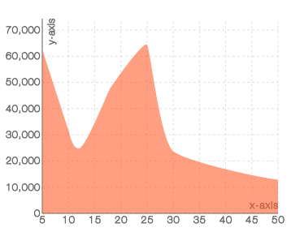

# `<AreaChart/>`

Component Renders graphically quantitative data.

### Props

#### `width <String> || <Number>`
The width you want to set the chart too. If used within [`<XYAxis/>`](XYAxis.md) you don't set this prop as `<XYAxis/>` will pass down it's width.

#### `height <String> || <Number>`
The height you want to set the chart too. If used within [`<XYAxis/>`](XYAxis.md) you don't set this prop as `<XYAxis/>` will pass down it's height.

#### `data <Array>`
The data you want to the chart to use. If used within [`<XYAxis/>`](XYAxis.md) you don't set this prop as `<XYAxis/>` will pass down the data.

#### `dataKey <String> || <Number>`
A key on the `data` prop for which to use to draw the `AreaChart`. This prop has to be set. if not set it will default to the `yDataKey` on the `<XYAxis/>`.

#### `color <String>`
The color that you want the AreaChart to have.

#### `colorOpacity <String || Number>`
The opacity you want to AreaChart to have.

### Examples

```js
var data = [
  {x: 5,  y: 63584, c: 62573},
  {x: 10, y: 42839, c: 31729},
  {x: 12, y: 35894, c: 24783},
  {x: 18, y: 58934, c: 47823},
  {x: 25, y: 74323, c: 64312},
  {x: 30, y: 24839, c: 23728},
  {x: 50, y: 12839, c: 12849}
];

<XYAxis width={350}
        height={300}
        data={data}
        xDataKey='x'
        yDataKey="y"
        grid={false}
        xLabel={'x-axis'}
        yLabel={'y-axis'}
        gridLines={'dashed'}>
  <AreaChart dataKey='c' color='#D1B6E1' colorOpacity={1}/>
</XYAxis>
</Panels>
```
<h2 align="center">Sample AreaChart</h2>
<p align="center">
  
</p>
