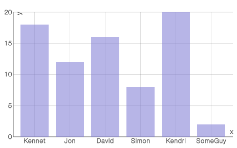

# `<BarChart/>`

Component Renders vertical bars to show comparisons among categories.

### Props

#### `width <String> || <Number>`
The width you want to set the chart too. If used within [`<XYAxis/>`](XYAxis.md) you don't set this prop as `<XYAxis/>` will pass down it's width.

#### `height <String> || <Number>`
The height you want to set the chart too. If used within [`<XYAxis/>`](XYAxis.md) you don't set this prop as `<XYAxis/>` will pass down it's height.

#### `data <Array>`
The data you want to the chart to use. If used within [`<XYAxis/>`](XYAxis.md) you don't set this prop as `<XYAxis/>` will pass down the data.

#### `dataKey <String> || <Number>`
A key on the `data` prop for which to use to draw the `BarChart`. This prop has to be set. if not set it will default to the `yDataKey` on the `<XYAxis/>`.

#### `color <String>`
The color that you want the BarChart to have.

#### `colorOpacity <String> || <Number>`
The opacity you want to BarChart to have.

### Examples
```js
var data = [
  {x: 'Kennet', y: 18},
  {x: 'Jon', y: 12},
  {x: 'David', y: 16},
  {x: 'Simon', y: 8},
  {x: 'Kendri', y: 20},
  {x: 'SomeGuy', y: 2},
];

<XYAxis data={data}
        grid={true}
        xLabel={'x'}
        yLabel={'y'}
        gridLines={'solid'}>
  <BarChart dataKey='y'/>
</XYAxis>
```
<h2 align="center">Sample BarChart</h2>
<p align="center">
  
</p>
