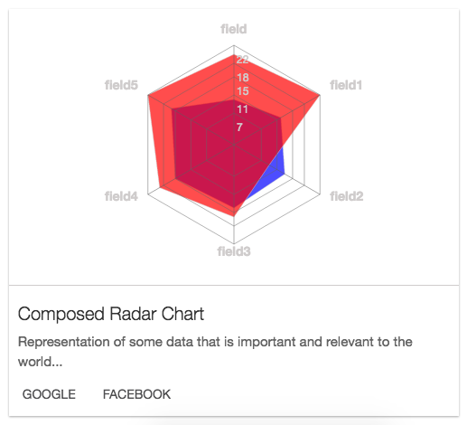

# `<Cards/>`

Component renders a card that may take in a chart followed by some descriptions and optionally links.

### Props

#### `imgURI <String>`
The imgURI to pass for the Card.

#### `width <String> || <Number>`
The width you want to set the card too.

#### `height <String> || <Number>`
The height you want to set the card too.

#### `imgWidth <String> || <Number>`
The width you want the imgWidth too.

#### `imgHeight <String> || <Number>`
The height you want the imgHeight too.

#### `header <String>`
The header(title) for the Cards

#### `detail <String>`
The detail you want to give the Cards.

#### `links <Array>`
An array of objects that has to have the shape of
```js
{
  link: <String>
  title: <String>
}
```

#### `linkColor <String>`
The color you want the link to be.

#### `graph <React Element>`
Optional parameter to place one of the graphs (Line, Area, etc.) in place of an img.

### Examples
```js
<Cards graph={
        <RadarChart width={350}
                    height={300}
                    data={data5}
                    rangeKey='y'
                    labelKey='skill'>
          <RadarArea dataKey='k1' color='blue' colorOpacity='.7'/>
        </RadarChart>
      }
       width='100%'
       height={450}
       header="Lonely Radar Chart"
       detail="Representation of some data that is important and relevant to the world 2..."
       links={[
         {
           href: 'http://google.com',
           title: 'google'
         },
         {
           href: 'http://facebook.com',
           title: 'facebook'
         }
       ]}>
</Cards>
```
<h2 align="center">Sample Card</h2>
<p align="center">
  
</p>
