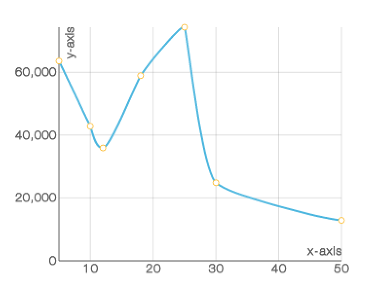

# `<LineChart/>`

Component Renders a series of data points connected by straight line segments.

### Props

#### `width <String> || <Number>`
The width you want to set the chart too. If used within [`<XYAxis/>`](XYAxis.md) you don't set this prop as `<XYAxis/>` will pass down it's width.

#### `height <String> || <Number>`
The height you want to set the chart too. If used within [`<XYAxis/>`](XYAxis.md) you don't set this prop as `<XYAxis/>` will pass down it's height.

#### `data <Array>`
The data you want to the chart to use. If used within [`<XYAxis/>`](XYAxis.md) you don't set this prop as `<XYAxis/>` will pass down the data.

#### `dataKey <String> || <Number>`
A key on the `data` prop for which to use to draw the `LineChart`. This prop has to be set. if not set it will default to the `yDataKey` on the `<XYAxis/>`.

#### `color <String>`
The color that you want the Lines of the LineChart to have.

#### `pointColor <String>`
The color that you want the Points on the LineChart to have.

#### `pointBorderColor <String>`
The color that you want the Points border on the LineChart to have.

### Examples
```js
var data = [
  {x: 5, y: 63584},
  {x: 10, y: 42839},
  {x: 12, y: 35894},
  {x: 18, y: 58934},
  {x: 25, y: 74323},
  {x: 30, y: 24839},
  {x: 50, y: 12839}
];

<XYAxis xyConfig={{
          width: 350,
          height: 300,
          grid: true,
          gridLines: 'solid',
          data: data,
          xDataKey: "x",
          yDataKey: "y",
          xLabel: 'x-axis',
          yLabel: 'y-axis',
          xTicks: 5,
          yTicks: 3
        }}>
  <LineChart dataKey='y'/>
</XYAxis>
```
<h2 align="center">Sample LineChart</h2>
<p align="center">
  
</p>
