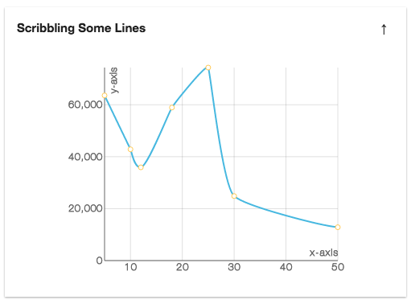
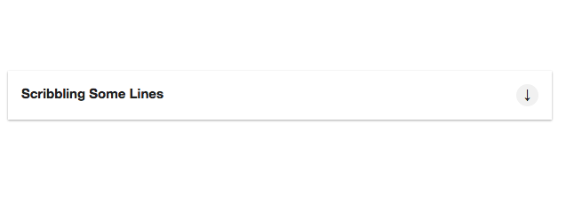

# `<Panels/>`

Component renders a slim rectangle with a title. When toggled displays content.

### Props

#### `width <String> || <Number>`
The width you want the Panels to be.

#### `height <String> || <Number>`
The height you want the Panels to be.

#### `Title <String>`
The title you want the Panels React Element to be.

### Examples
```js
<Panels width='100%' title='Scribbling Some Lines'>
  <XYAxis xyConfig={{
            width: 350,
            height: 300,
            grid: true,
            gridLines: 'solid',
            data: data3,
            xDataKey: "x",
            yDataKey: "y",
            xLabel: 'x-axis',
            yLabel: 'y-axis',
            xTicks: 5,
            yTicks: 3
          }}>
    <LineChart dataKey='y'/>
  </XYAxis>
</Panels>
```
<h2 align="center">Sample Panels</h2>
<p align="center">
  
</p>
<p align="center">
  
</p>
