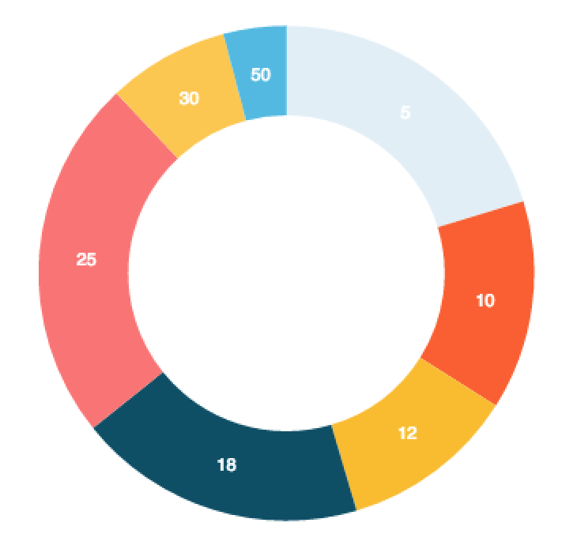

# `<PieChart/>`

Component Renders a circle is divided into sectors that each represent a proportion of the whole. (set it to Donut chart by passing in donut prop)

### Props

#### `width <String> || <Number>`
The width you want to set the chart too. If used within [`<XYAxis/>`](XYAxis.md) you don't set this prop as `<XYAxis/>` will pass down it's width.

#### `height <String> || <Number>`
The height you want to set the chart too. If used within [`<XYAxis/>`](XYAxis.md) you don't set this prop as `<XYAxis/>` will pass down it's height.

#### `radius <Number>`
a straight line from the center to the circumference of a circle.

#### `data <Array>`
The data you want to the chart to use. If used within [`<XYAxis/>`](XYAxis.md) you don't set this prop as `<XYAxis/>` will pass down the data.

#### `dataKey <String> || <Number>`
A key on the `data` prop for which to use to draw the `PieChart`. This prop has to be set. if not set it will default to the `yDataKey` on the `<XYAxis/>`.

#### `labelKey <String> || <Number>`
A key on the `data` prop for which to use to label the slices of the `PieChart`. This prop has to be set. if not set it will default to the `xDataKey` on the `<XYAxis/>`.

#### `colors <Array>`
The color that you want the points of the ScatterPlot to have.

#### `textColor <String>`
The color you want the text on the `PieChart` to be.

#### `donut <Number>`
This property is used to turn the PieChart into a donut chart. It takes a number and should be at least 2.5 or larger to make the center of the chart unfill.

### Examples
```js
var data = [
  {x: 5, y: 63584},
  {x: 10, y: 42839},
  {x: 12, y: 35894},
  {x: 18, y: 58934},
  {x: 25, y: 74323},
  {x: 30, y: 24839},
  {x: 50, y: 12839}
];

var color = [
  "#e1eef6","#ff5f2e","#fcbe32","#004e66","#ff7473","#ffc952","#47b8e0",
  "#34314c","#47b8e0","#47b8e0",
];

//Pie
<PieChart width={350}
          height={300}
          radius={150}
          data={data3}
          dataKey='y'
          labelKey='x'
          colors={color}/>
//Donut
<PieChart width={350}
          height={300}
          radius={150}
          donut={2.5}
          data={data}
          dataKey='y'
          labelKey='x'
          colors={color}
/>
```
<h2 align="center">Sample PieChart</h2>
<p align="center">
  
</p>
<h2 align="center">Sample PieChart (Donut)</h2>
<p align="center">
  
</p>
