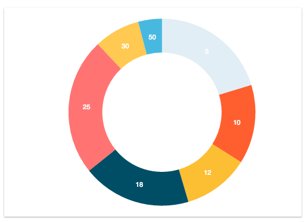

# `<Platter/>`

Component renders a rectangle with a nice shadow to that takes in a chart and provides contrast from background.

### Props

#### `width <String> || <Number>`
The width you want the Platter to be.

#### `height <String> || <Number>`
The height you want the Platter to be.

#### `backgroundColor <String>`
The backgroundColor you want the `<Platter/>` to be. Keep in mind this can be
set with a class/className on the Platter element.

### Examples
```js
<Platter width="100%">
    <XYAxis width={800}
            height={500}
            data={data3Check}
            xDataKey='x'
            yDataKey='y'
            grid={true}
            gridLines={'solid'}>
      <AreaChart dataKey='a'/>
      <LineChart dataKey='l' pointColor="#ffc952" pointBorderColor='#34314c'/>
    </XYAxis>
</Platter>
```
<h2 align="center">Sample Platter</h2>
<p align="center">
  
</p>
