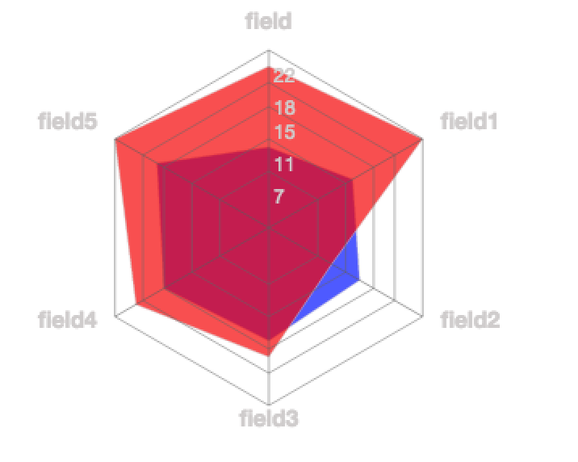

# `<RadarChart/>`

Component Renders a sequence of equi-angular spokes called radii with an overlayed area(([`<RadarArea/>`](RadarArea.md)) to provide comparisons of the dataset.

### Props

#### `width <String> || <Number>`
The width you want to set the chart too.

#### `height <String> || <Number>`
The height you want to set the chart too.

#### `data <Array>`
The data you want to the chart to use.

#### `rangeKey <String> || <Number>`
A key on the `data` prop for which to use to draw the `RadarChart`. This prop has to be set.

#### `labelKey <String> || <Number>`
A key on the `data` prop for which to use to label the slices of the `RadarChart`. This prop has to be set.

### Examples
```js
var data5 = [
    { "skill": "field", y: 16, k1: 10, k2: 20 },
    { "skill": "field1", y: 10, k1: 12, k2: 22 },
    { "skill": "field2", y: 10, k1: 13, k2: 9 },
    { "skill": "field3", y: 11, k1: 14, k2: 16 },
    { "skill": "field4", y: 15, k1: 15, k2: 19 },
    { "skill": "field5", y: 22, k1: 16, k2: 22 }
];

<RadarChart width={350}
            height={300}
            data={data}
            rangeKey='y'
            labelKey='skill'>
  <RadarArea dataKey='k1' color='blue' colorOpacity='.7'/>
  <RadarArea dataKey='k2' color='red' colorOpacity='.7'/>
</RadarChart>
```
<h2 align="center">Sample RadarChart</h2>
<p align="center">
  
</p>
