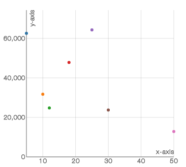

# `<ScatterPlot/>`

Component Renders a plot based on one or many datasets.

### Props

#### `width <String> || <Number>`
The width you want to set the chart too. If used within [`<XYAxis/>`](XYAxis.md) you don't set this prop as `<XYAxis/>` will pass down it's width.

#### `height <String> || <Number>`
The height you want to set the chart too. If used within [`<XYAxis/>`](XYAxis.md) you don't set this prop as `<XYAxis/>` will pass down it's height.

#### `data <Array>`
The data you want to the chart to use. If used within [`<XYAxis/>`](XYAxis.md) you don't set this prop as `<XYAxis/>` will pass down the data.

#### `dataKey <String> || <Number>`
A key on the `data` prop for which to use to draw the `ScatterPlot`. This prop has to be set. if not set it will default to the `yDataKey` on the `<XYAxis/>`.

#### `scatterKey <String> || <Number>`
ScatterPlot's can be used to display lots of data on one plane. Sometimes its to see how groups of data are different from each other, and other times to see how one group of data fluctuates. scatterKey is optional but should be used for differentiating between 2 groups of data. i.e. the percentage of people who prefer dessert over dinner and scatterKey would be 'desert' and 'dinner' each of which would have their own color to differentiate.

#### `pointRadius <Number>`
The radius that you want the Points on the ScatterPlot to have.

#### `colors <Array>`
The color that you want the points of the ScatterPlot to have.

### Examples
```js
var data = [
  {x: 5,  y: 63584, c: 62573},
  {x: 10, y: 42839, c: 31729},
  {x: 12, y: 35894, c: 24783},
  {x: 18, y: 58934, c: 47823},
  {x: 25, y: 74323, c: 64312},
  {x: 30, y: 24839, c: 23728},
  {x: 50, y: 12839, c: 12849}
];

<XYAxis width={350}
                   height={350}
                   data={data3Check}
                   xDataKey='x'
                   yDataKey='y'
                   grid={true}
                   gridLines={'solid'}>
              <ScatterPlot data={data4Check}
                           dataKey='c'
                           pointRadius={3}/>
            </XYAxis>
```
<h2 align="center">Sample ScatterPlot</h2>
<p align="center">
  
</p>
