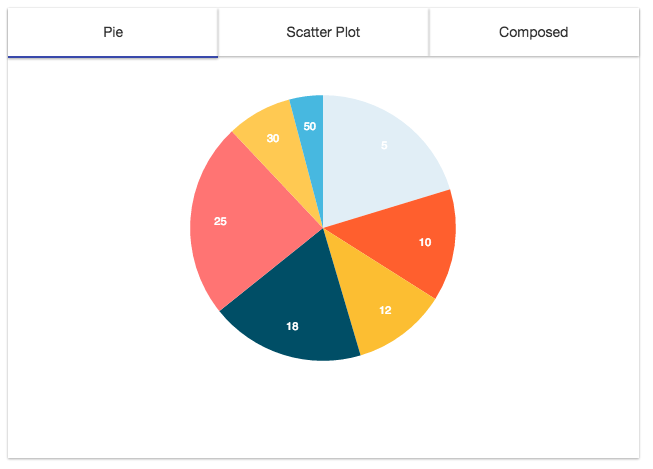

# `<Tabs/>`

Component renders tabs that represent what content to show based on the active tab.

### Props

#### `width <String> || <Number>`
The width you want to set the Tabs too.

#### `height <String> || <Number>`
The height you want to set the Tabs too.

#### `backgroundColor <String>`
The backgroundColor you want the Tabs to be. However you can also add styles by adding a class/className to the Tabs component.

#### `tabColor <String>`
The color you want the "Active" tab that is showing content to be.

#### `tabs <Array>`
The number of tabs you want the `<Tabs/>` component to have.
```js
{
  title: <String>,
  Component <React Element>
}
```

### Examples
```js
<Tabs width='100%'
      height={450}
      tabs={[
              {
                title: 'Pie',
                component: <PieChart width={350}
                                     height={300}
                                     radius={150}
                                     data={data}
                                     dataKey='y'
                                     labelKey='x'
                                     colors={color}/>
              },
              {
                title: 'Scatter Plot',
                component: <XYAxis width={350}
                                   height={350}
                                   data={data2}
                                   xDataKey='x'
                                   yDataKey='y'
                                   grid={true}
                                   gridLines={'solid'}>
                              <ScatterPlot dataKey='c'
                                           pointRadius={3}/>
                            </XYAxis>
              },
              {
                title: 'Composed',
                component: <XYAxis width={350}
                                    height={300}
                                    data={data3}
                                    xDataKey='x'
                                    yDataKey='y'
                                    grid={true}
                                    gridLines={'solid'}>
                              <AreaChart dataKey='a'/>
                              <LineChart dataKey='c' pointColor="#ffc952" pointBorderColor='#34314c'/>
                            </XYAxis>
              }
            ]}
/>
```
<h2 align="center">Sample Tabs</h2>
<p align="center">
  
</p>
